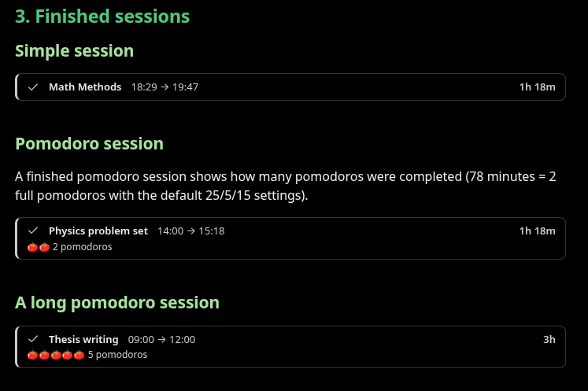
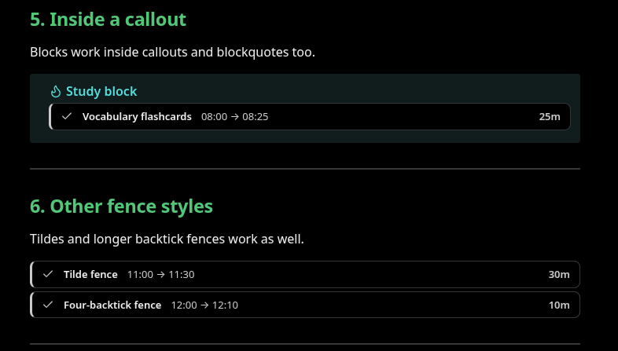

# Timebox

Track how long you work on something, right inside your [Obsidian](https://obsidian.md) notes.

Start a session and a small code block is inserted into your note. It renders as a **session bar**: the topic, the start time and a live timer. When you finish, the end time and total duration are written into the note too. You can also run a session in **pomodoro** mode, with focus and break phases and an alert whenever the phase changes.

Everything is stored as plain text in the note itself, so your sessions stay readable even without the plugin.



## Features

- A live session bar inside the note: `18:29 → in progress` with a timer that updates every second (`42:13`, `1:05:09`)
- One click on **Finish** writes the end time and duration (`1h 18m`) into the block
- Optional **pomodoro mode**: a phase progress bar, `🍅 Pomodoro 2 · Focus · 12:47 left`, green during breaks
- An on-screen notice, a short beep and (optionally) a system notification when the phase changes
- The active session in the status bar; click it to open the session's note
- Survives restarts: the pomodoro phase is calculated from the time elapsed since the start, so no timer state is stored
- You can write or edit blocks by hand; several date formats are supported
- Works with light and dark mode and community themes, on desktop and mobile

## Installation

### From Community plugins

1. Open **Settings → Community plugins → Browse**.
2. Search for **Timebox** and select **Install**.
3. Select **Enable**.

### Manually

1. Download `main.js`, `manifest.json` and `styles.css` from the [latest release](../../releases/latest).
2. Create the folder `.obsidian/plugins/timebox/` inside your vault and put the three files in it.
3. In Obsidian, go to **Settings → Community plugins**, reload the list and enable **Timebox**.

## Usage

1. In a note, put the cursor on the line where you want the session bar.
2. Open the command palette (`Ctrl/Cmd + P`) and run **Timebox: Start session**, or select the ⏱ icon in the left ribbon.
3. Type what you're working on (e.g. `Math Methods`) and press `Enter`.
   - If text is selected in the note, it's used as the topic.
   - If you leave it empty, the note name is used.
4. When you're done, select **Finish** on the bar or run **Finish active session**.

If the cursor line is empty, the block replaces it; otherwise the block goes on the line below. The cursor then moves below the block so you can keep typing.

Starting a new session automatically finishes any session that's still open, at the current time. You can turn this off in the settings.

## Block format

A session is stored in a `timebox` code block:

````markdown
```timebox
topic: Math Methods
start: 2026-09-28 18:29:05
mode: pomodoro
```
````

When the session finishes, two lines are added:

````markdown
```timebox
topic: Math Methods
start: 2026-09-28 18:29:05
mode: pomodoro
end: 2026-09-28 19:47:05
duration: 1h 18m
```
````

### Keys

| Key        | Description                                                                         |
| ---------- | ----------------------------------------------------------------------------------- |
| `topic`    | What the session is about. Optional.                                                |
| `start`    | Start time. **Required.**                                                           |
| `mode`     | `pomodoro` or `simple`. Defaults to `simple`.                                       |
| `end`      | End time. Without it, the session is still running.                                |
| `duration` | For your reference only. It's ignored when reading and recalculated from `end`.     |

- Keys are case-insensitive: `Start`, `START` and `start` all work.
- Lines the plugin doesn't recognize (e.g. `note: p. 42`) are never touched and stay where they are when the block is updated.
- If a block can't be read (e.g. `start` is missing), a warning box explaining the problem is shown instead of the bar.
- Blocks can be fenced with ` ``` `, ` ~~~ ` or four or more backticks. Blocks inside blockquotes (`>`) and callouts work too.



### Time formats

| Format                                       | Example                                   |
| -------------------------------------------- | ----------------------------------------- |
| `YYYY-MM-DD HH:mm` or `YYYY-MM-DD HH:mm:ss`  | `2026-09-28 18:29`, `2026-09-28 18:29:05` |
| `DD.MM.YYYY HH:mm` or `DD.MM.YYYY HH:mm:ss`  | `28.09.2026 18:29`                        |
| `HH:mm` or `HH:mm:ss` (time only)            | `18:29`                                   |

- If `start` is only a time, the **note's creation date** is used as the day.
- If `end` is only a time, the start day is used. If that time is earlier than the start, the session crossed midnight and the end moves to the next day. For example, `start: 23:40` and `end: 00:20` is a 40-minute session. The bar shows `(+1)` next to the end time.

When the plugin finishes a session it rewrites the times in full (`2026-09-28 18:29:05`), so the date isn't lost if the note is copied to another device.

## Pomodoro

The cycle is: focus, short break, focus, short break… After every 4th focus period, a long break replaces the short one. The durations and the long-break interval can be changed in the settings (defaults: 25 / 5 / 15 minutes, a long break every 4 pomodoros).

- While focusing: `🍅 Pomodoro 2 · Focus · 12:47 left`
- During a break: `☕ Short break · 02:20 left` (the bar turns green)
- A finished session shows the completed pomodoros: `🍅🍅🍅 3 pomodoros`

The phase is always calculated from the start time, so you see the right phase even after restarting Obsidian or opening the note on another device. As a consequence, if you change the pomodoro durations, the phases of running and finished sessions are recalculated with the new durations.

When the phase changes:

- an Obsidian notice appears for 10 seconds,
- a short beep plays (can be turned off),
- if **System notification** is on, your operating system shows a notification too (permission is requested the first time).

Alerts only work while Obsidian is open.

## Commands

| Command                             | What it does                                                               |
| ----------------------------------- | -------------------------------------------------------------------------- |
| Start session                       | Starts a session in the default mode from the settings.                    |
| Start pomodoro session              | Starts a session in pomodoro mode.                                         |
| Start simple session (no pomodoro)  | Starts a session that only tracks time.                                    |
| Finish active session               | Finishes the active session in the current note, or else the newest one.   |

You can assign hotkeys to these in **Settings → Hotkeys** (search for "Timebox").

## Settings

| Setting                          | Default | Description                                                          |
| -------------------------------- | ------- | -------------------------------------------------------------------- |
| Default mode                     | Simple  | Mode used by "Start session" and the ribbon icon.                    |
| Finish previous session on start | On      | Starting a new session finishes open sessions at the current time.   |
| Focus duration                   | 25 min  |                                                                      |
| Short break                      | 5 min   |                                                                      |
| Long break                       | 15 min  |                                                                      |
| Long break interval              | 4       | A long break after this many pomodoros.                              |
| Sound                            | On      | Beep on phase change.                                                |
| System notification              | Off     | Operating system notification on phase change.                      |
| Status bar                       | On      | Show the active session in the status bar.                           |

## FAQ

**Where is my data stored?**
Your sessions live only in your notes, inside the code blocks. The plugin's own `data.json` stores the settings and a list of currently open sessions (note path, start time, topic, mode). That list powers the status bar and the alerts. It's updated when a note is moved or renamed and cleaned up when a note is deleted. Sessions that are no longer in their note, or that were finished by hand, are also removed from it every 30 seconds.

**Can I edit a block by hand?**
Yes. You can change the start, end or topic, and add your own lines inside the block. An open session you write by hand is picked up as an active session when the note is displayed.

**Does it work on mobile?**
Yes. Mobile has no status bar and no system notifications; the bar, the commands and the pomodoro phases all work.

## Development

Requires Node.js 18 or later.

```bash
npm install
npm run dev     # build in watch mode (main.js)
npm test        # unit tests for src/core.ts
npm run build   # type check + production build
```

Instead of copying files after every change, symlink the project folder into a vault:

```bash
ln -s "$(pwd)" "/path/to/vault/.obsidian/plugins/timebox"
```

While `npm run dev` is running, changes are written to `main.js`. Reload the plugin by disabling and enabling it, or use the [Hot Reload](https://github.com/pjeby/hot-reload) plugin.

Project layout:

| File                     | Contents                                                                              |
| ------------------------ | ------------------------------------------------------------------------------------- |
| `src/core.ts`            | Pure logic: block parsing/writing, time formats, pomodoro phases. No Obsidian imports. |
| `src/main.ts`            | The plugin: commands, starting/finishing sessions, status bar, active session list.   |
| `src/settings.ts`        | Settings and the settings tab.                                                        |
| `src/ui/session-bar.ts`  | The session bar rendered inside notes.                                                |
| `src/ui/topic-modal.ts`  | The dialog that asks for the topic.                                                   |
| `src/ui/alerts.ts`       | Notices, the beep and system notifications.                                           |
| `test/core.test.ts`      | Unit tests.                                                                           |

### Releasing

1. `npm version patch` (or `minor` / `major`). This also updates `manifest.json` and `versions.json`.
2. `git push --follow-tags`
3. GitHub Actions builds the plugin and creates a draft release. Add release notes and publish it.

## License

[MIT](LICENSE) © 2026 Samed Yolcu
